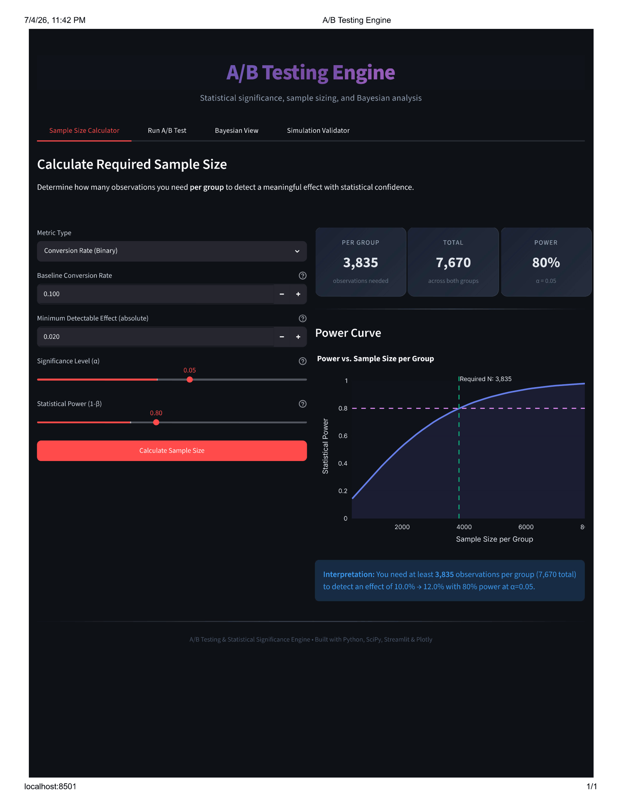
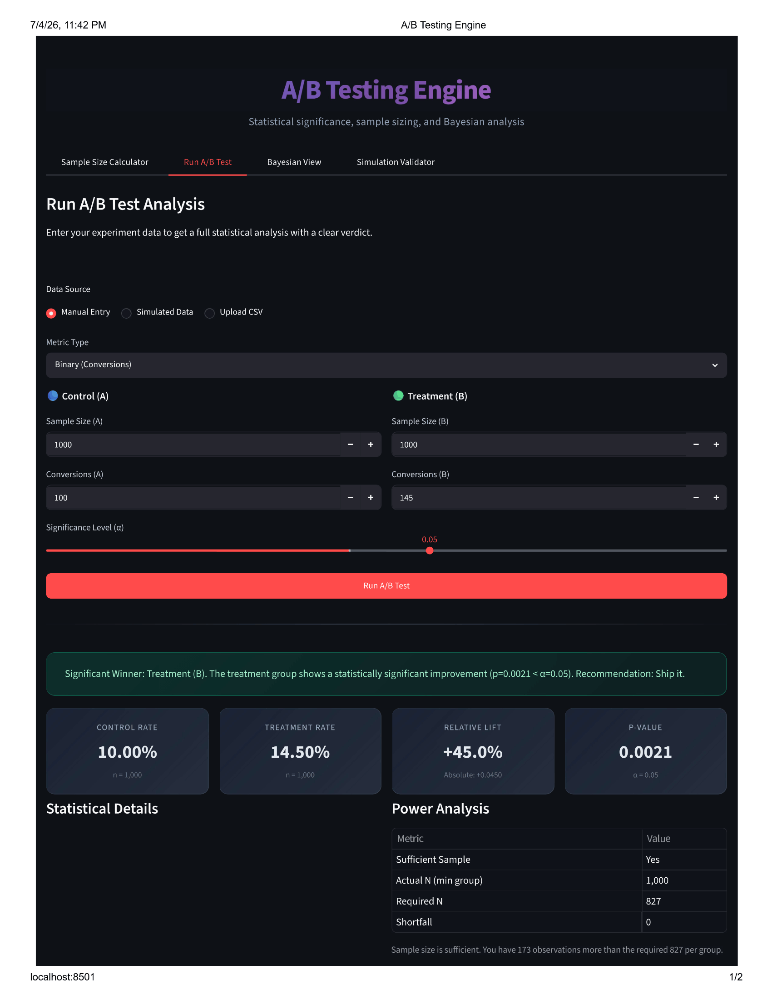
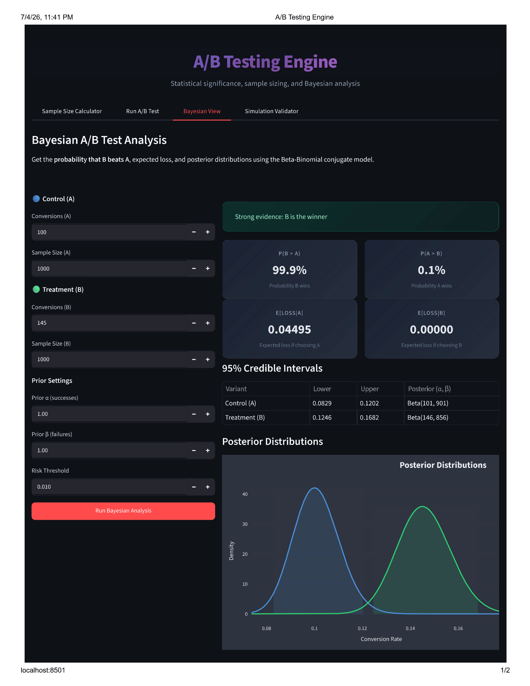
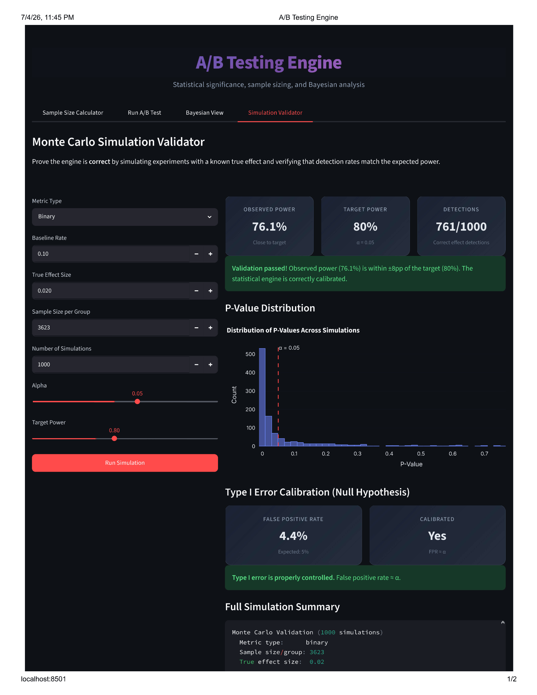
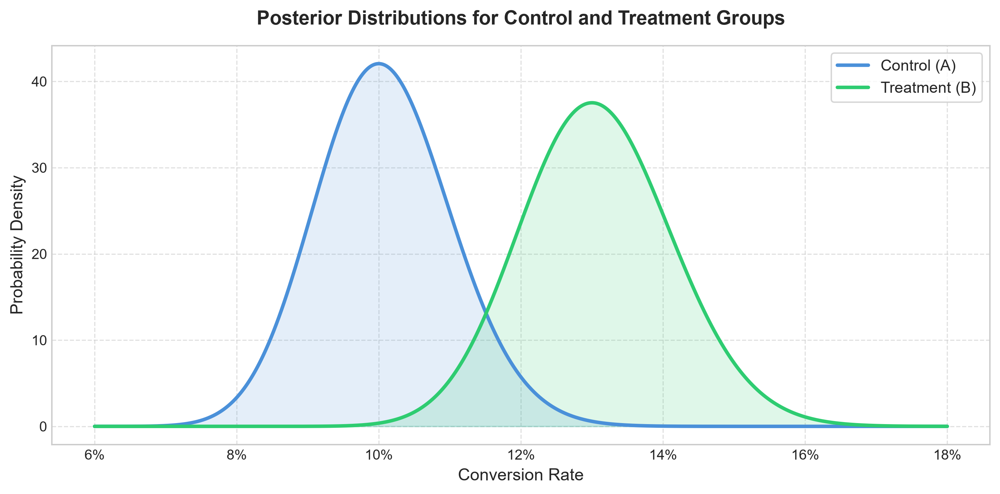

# A/B Testing and Statistical Significance Engine


A statistical experimentation library for sample size estimation, hypothesis testing, frequentist A/B test evaluation, and Bayesian analysis. Unlike production libraries such as Wise's tw-experimentation, this project prioritizes depth of implementation and statistical validation over breadth of features — every method here is built and tested from first principles rather than using an existing statistics library's high-level API.

This engine is designed to provide robust statistical tools for analysis, validation, and decision-support in product experimentation.

---

## Key Features

* **Sample Size Determination:** Estimate required sample sizes for both binomial proportions (conversion rates) and continuous metrics (e.g., revenue per user).
* **Statistical Hypothesis Testing:** Programmatic implementations of standard frequentist tests with uniform outputs (p-value, confidence interval, and standardized effect size).
* **Multi-Variant Testing:** Support for multiple comparisons with Bonferroni correction to control the family-wise false positive rate.
* **Bayesian A/B Analysis:** Conjugate Beta-Binomial models to estimate posterior distributions, probability of superiority, and expected risk (expected loss).
* **Monte Carlo Simulator:** Generate synthetic experiment datasets to perform statistical power analysis and Type I error rate calibration.
* **Interactive Dashboard:** Streamlit-based UI for real-time calculation, visualization of posterior distributions, and simulation runs.

---

## Supported Statistical Tests

| Statistical Test | Metric Type | Target Data Type |
|------------------|-------------|------------------|
| Two-sample t-test | Continuous | Normally distributed continuous metrics |
| Z-test for proportions | Binary | Binomial successes / conversion rates |
| Chi-square test of independence | Categorical / Binary | Contingency tables |
| One-way ANOVA | Continuous | Comparisons across three or more groups |
| Mann-Whitney U test | Continuous / Ordinal | Non-parametric distributions (skewed data) |
| Beta-Binomial Bayesian model | Binary | Probability of superiority and risk estimation |

---

## Project Structure

```
ab-testing-engine/
├── src/
│   ├── __init__.py              # Package initializer
│   ├── sample_size.py           # Sample size calculators (proportions + continuous)
│   ├── hypothesis_tests.py      # Core statistical tests (t-test, z-test, chi-sq, ANOVA, Mann-Whitney)
│   ├── ab_engine.py             # A/B test evaluation engine (lift, CI, p-value, effect sizes)
│   ├── bayesian_ab.py           # Bayesian A/B testing (Beta-Binomial, P(B>A), expected loss)
│   └── simulator.py             # Synthetic experiment generator + power validation
├── tests/
│   ├── test_sample_size.py      # Validation against statsmodels references
│   ├── test_hypothesis_tests.py # Unit tests for frequentist methods
│   ├── test_ab_engine.py        # End-to-end evaluation scenario tests
│   ├── test_bayesian_ab.py      # Posterior calculation and simulation verification
│   └── test_simulation_validation.py # Monte Carlo power and Type I error checks
├── reports/
│   └── figures/                 # Directory for output plots
├── app.py                       # Streamlit dashboard
├── requirements.txt             # Project dependencies
├── setup.cfg                    # Pytest configuration
├── LICENSE                      # MIT License
└── README.md                    # Project documentation
```

---

## Getting Started

### Installation

1. Clone the repository:
   ```bash
   git clone <repository-url>
   cd ab-testing-engine
   ```

2. Set up a virtual environment and install dependencies:
   ```bash
   python -m venv .venv
   source .venv/bin/activate    # Linux/MacOS
   .venv\Scripts\activate       # Windows

   pip install -r requirements.txt
   ```

### Running the Dashboard

Launch the interactive Streamlit dashboard:
```bash
streamlit run app.py
```

### Running Tests

Execute the unit test suite with pytest:
```bash
# Run all tests
pytest tests/ -v

# Skip the slow Monte Carlo simulation tests
pytest tests/ -v -m "not slow"
```

---

## Dashboard Preview

### Sample Size Calculator


### A/B Test Runner


### Bayesian View


### Simulation Validator


---

## Usage Guide

### 1. Sample Size Estimation

```python
from src.sample_size import sample_size_proportions

n = sample_size_proportions(
    baseline_rate=0.10,    # 10% baseline conversion rate
    mde=0.02,              # 2% minimum detectable effect
    alpha=0.05,            # 5% significance level
    power=0.80             # 80% target power
)
print(f"Required sample size per group: {n}")
# Output: Required sample size per group: 3623
```

### 2. Running an A/B Test (Frequentist)

```python
from src.ab_engine import run_ab_test

result = run_ab_test(
    successes_a=120, n_a=1000,
    successes_b=145, n_b=1000,
    metric_type="binary"
)

print(f"Control Conversion Rate: {result.control_estimate:.2%}")
print(f"Treatment Conversion Rate: {result.treatment_estimate:.2%}")
print(f"Relative Lift: {result.relative_lift:+.1f}%")
print(f"P-value: {result.test_result.p_value:.4f}")
print(f"Recommendation: {result.verdict}")
```

### 3. Running a Bayesian Comparison

```python
from src.bayesian_ab import run_bayesian_ab

bayes_result = run_bayesian_ab(
    successes_a=120, trials_a=1000,
    successes_b=145, trials_b=1000
)

print(f"Probability B beats A: {bayes_result.prob_b_beats_a:.1%}")
print(f"Expected Loss choosing B: {bayes_result.expected_loss_choosing_b:.5f}")
print(f"Verdict: {bayes_result.verdict}")
```

---

## Statistical Validation and Calibration

To ensure the statistical accuracy of the calculations:
* **Power Calibration:** Using Monte Carlo simulations, we verify that at the calculated minimum sample size, the observed true positive rate matches the theoretical target power (e.g., ~80% detection rate).
* **Type I Error Rate Control:** Running simulations under the null hypothesis (true effect size = 0) confirms that the false positive rate converges to the selected alpha value (e.g., ~5%).
* **Sample Size Verification:** The A/B evaluation module runs standard power analysis, warning the user if the actual sample size is underpowered for detecting the observed effect size.

---

## Statistical Methods

### Frequentist Approach
- Tests the null hypothesis H₀: "no difference between groups"
- Reports p-value: probability of observing this result (or more extreme) if H₀ is true
- Decision: reject H₀ if p < α

### Bayesian Approach
- Uses Beta(1,1) uninformative prior (conjugate to Binomial likelihood)
- Updates with observed data → Beta(α + successes, β + failures) posterior
- Reports P(B > A) via Monte Carlo sampling from posteriors
- Reports expected loss: E[max(other − chosen, 0)]
- Decision: based on probability threshold and risk tolerance

### When They Disagree
The frequentist and Bayesian approaches can disagree on borderline cases. The Bayesian approach provides richer information (probability of winning + expected cost of being wrong) while the frequentist approach provides a simple binary decision with controlled error rates.

**Example:** With a p-value of 0.052 (just above the 0.05 significance threshold) but P(B>A) = 91%, the frequentist test concludes "not significant" while the Bayesian analysis suggests B is likely better, with a quantified probability and expected loss if wrong. This project's dashboard surfaces both views side by side so a business user can weigh the evidence directly rather than relying on a single binary pass/fail threshold.


Example posterior distributions for control (A) and treatment (B) — the separation between curves visualizes the confidence in B's improvement.

---

## Limitations & Assumptions
- Bayesian model assumes a Beta(1,1) uninformative prior — results would differ with an informative prior based on historical data
- The t-test assumes roughly normal data; use Mann-Whitney for heavily skewed metrics
- Multiple testing correction (Bonferroni) is applied for multi-variant comparisons, but not automatically across many simultaneous metrics — that requires separate correction if testing several KPIs at once
- Sequential/continuous monitoring ("peeking") is not supported — sample size is fixed upfront before the experiment starts, as is standard in classical (non-sequential) A/B testing
- The engine assumes independent, identically distributed observations per group (e.g., no repeated measurements from the same user counted twice)

---

## Technical Stack

* **Language:** Python 3.9+
* **Statistics:** SciPy (`scipy.stats`), statsmodels
* **Data Processing:** pandas, NumPy
* **Visualization:** Plotly, Matplotlib, Seaborn
* **Dashboard:** Streamlit
* **Testing Framework:** pytest

---

## License

This project is licensed under the MIT License - see the [LICENSE](LICENSE) file for details.
